# its-alive
Uses `host` command  to check if a subdomain/domain it's alive (by performing DNS lookups). 
Saves the live domains/subdomains in a file.

### Usage example

**Use responsibly**

### credits:
inspired by a technique shown this article:

https://www.hackerone.com/blog/Guide-Subdomain-Takeovers

(however the technique shown there doesn't permit to end the script with Ctrl+C)
